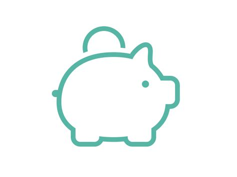

  <h1>Saving Box</h1>

    

    
    
    
    

## Preview

Welcome to **Money Box** iOS project repository!

This is a skinned version of a Fin-tech piggy bank application.

Application architecture is MVVM with Coordinator pattern for navigation.
I've set up a simple binding system for VC-VM communication.
There are Unit Tests for all ViewModels. Test coverage ~45%
Layouts are done in Interface Builder as requested.
I've added a Keychain library to present that I can use the Adapter pattern (and so I can unit test it)

##  TODO

*Disclaimer*
Things are far from perfect. Here's the list of what's missing in this project:
- Bearer token expiration is not handled. Once it's expired, you have to restart the app.
- App state is not saved. Every new launch is a fresh start for the app. Even when the valid bearer token is saved to Keychain.
- There are no loading screens nor animations implemented.
- The UI is pretty much non existent. I chose to pursue simple wireframe stylistics.
- There is no email and password validation. Both texts in Textfields are hard-coded.

## Help

If you don't understand the code or there is some other issue that you would like to discuss feel free to drop an e-mail at
`marcelmierzejewski@gmail.com`
